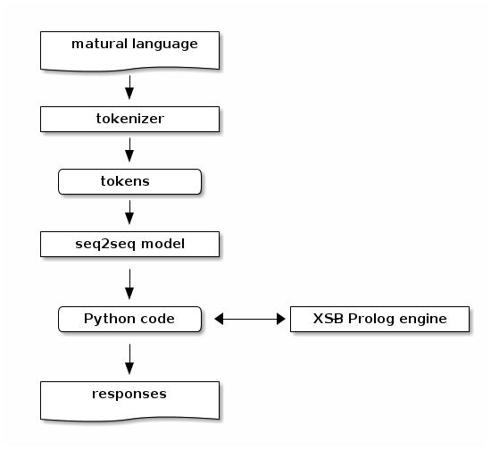
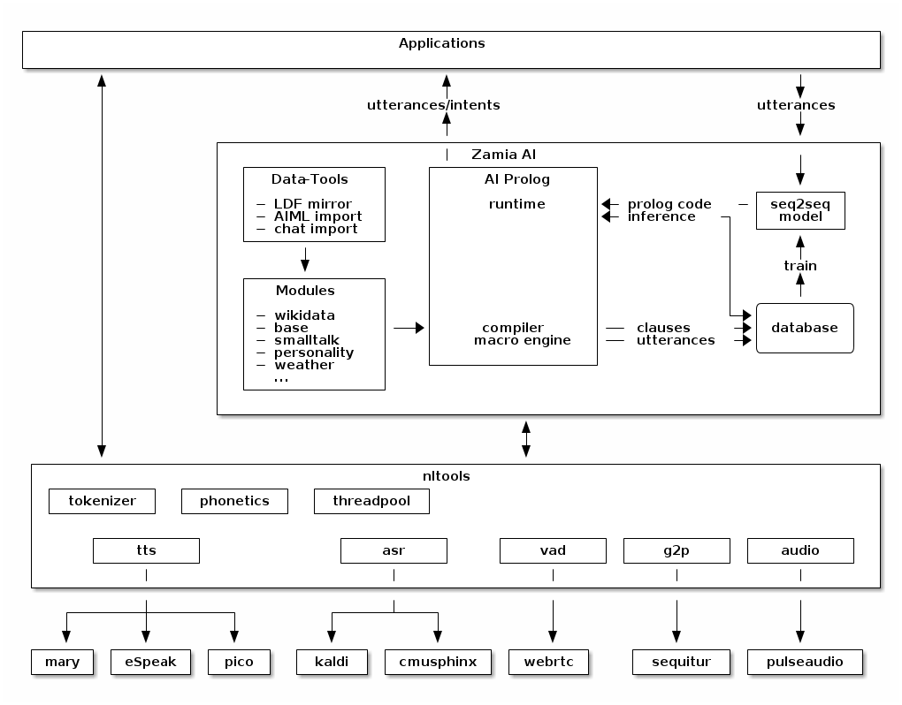

Architecture
------------

Right now the rough idea is to use XSB Prolog at the core for knowledge storage, processing and
reasoning plus a seq2seq model to map natural language to python code which queries the Prolog engine.

ifndef::env-github[]
[ditaa,"flow"]
....
  +-------------------+        +-------------------+
  |  Natural language |        |  Structured Data  |  
  |                {d}|        |  (RDF/LDF, AIML)  |
  +-------------------+        |                {d}|
            |                  +-------------------+
            |                          |    |
            v                          |    |
 +---------------------+               |    |
 | Deep Neural Network |<-- training --+    |
 |       seq2seq       |                    |
 +---------------------+                    |
            |                               |
            |                               v
            v                 +------------------+
    /---------------\         |    XSB Prolog    |
    |  Python code  | <------>|     Reasoner     |     
    \---------------/         |  Knowledge Base  |
            |                 +------------------+
            |                 
            v
  +-------------------+
  |     responses     |
  |                {d}|
  +-------------------+

....
endif::env-github[]
ifdef::env-github[]

endif::env-github[]

From a code organization perspective Zamia AI's architecture looks like this:

ifndef::env-github[]
[ditaa,"highlevel"]
....
+------------------------------------------------------------------------------------------------+
|                                         Applications                                           |
|                                                                                                |
+------------------------------------------------------------------------------------------------+
         ^                                      ^                                       |
         |                                      |                                       v
         |                                response/actions                       input/utterance
         |                                      ^                                       |
         |                                      |                                       v
         |            +--------------------------------------------------------------------------+
         |            |                         |        Zamia AI                       |        |
         |            |  +---------------+      |                                       |        |
         |            |  |  Data-Tools   |      |                                       v        |
         |            |  |               |      |          /-------------\         +---------+   |
         |            |  | - LDF mirror  |      +----------| Python code |<--------| seq2seq |   |
         |            |  | - RDF2Prolog  |                 \-------------/         |  model  |   |
         |            |  | - AIML import |                        ^                +---------+   |
         |            |  | - chat import |                        |                     ^        |
         |            |  +---------------+                        v                     |        |
         |            |         |                +-----------------------+                       |
         |            |         v                |      XSB Prolog       |            train      |
         |            |  +---------------+       +-----------------------+                       |
         |            |  |   Modules     |              ^                               |        |
         |            |  |               |              |                               |        |
         |            |  | - data        |    +------------------+                 /----------\  |
         |            |  | - base        |    |                  |                 |          |  |
         |            |  | - dialog      |--->|     compiler     |--- Python     ->| database |  |
         |            |  | - personality |    |    macro engine  |--- utterances ->|          |  |
         |            |  | - weather     |    |                  |                 \----------/  |
         |            |  |   ...         |    +------------------+                               |
         |            |  +---------------+                                                       |
         |            |                                                                          |
         |            +--------------------------------------------------------------------------+
         |                                               ^
         |                                               |
         v                                               v
 +-----------------------------------------------------------------------------------------------+
 |                                           nltools                                             |
 | +-----------+  +-----------+  +------------+                                                  |
 | | tokenizer |  | phonetics |  | threadpool |                                                  |
 | +-----------+  +-----------+  +------------+                                                  |
 |                                                                                               |
 |      +-----------+               +-----------+     +-----------+ +-----------+ +-----------+  |
 |      |    tts    |               |    asr    |     |    vad    | |    g2p    | |   audio   |  |
 |      +-----------+               +-----------+     +-----------+ +-----------+ +-----------+  |
 |            |                           |                 |             |             |        |
 +-----------------------------------------------------------------------------------------------+
              |                           |                 |             |             |          
     +--------+---------+          +------+----+            |             |             |
     |        |         |          |           |            |             |             |
     v        v         v          v           v            v             v             v
 +------+ +--------+ +------+  +-------+ +-----------+ +--------+    +----------+ +------------+ 
 | mary | | eSpeak | | pico |  | kaldi | | cmusphinx | | webrtc |    | sequitur | | pulseaudio |
 +------+ +--------+ +------+  +-------+ +-----------+ +--------+    +----------+ +------------+
....
endif::env-github[]
ifdef::env-github[]

endif::env-github[]

One of the key features of the current setup is the way training data is stored/generated.
I am using a modularized approach here (see the modules/ directory for humble beginnings of this)
where I store snippets of natural language which uses a macro system for somewhat rule-based
generation of language examples (optionally incorporating data from the prolog knowledge base) 
and python code to execute it.
